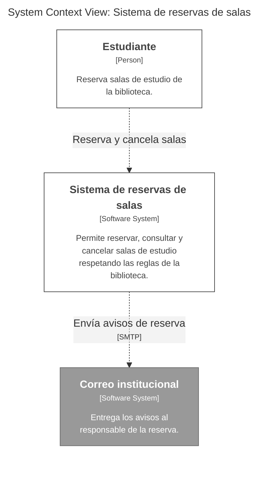

# Vista: Contexto

Generado con `scripts/exportar.sh` a partir de `docs/c4/workspace.dsl`. No lo edite a mano.

```mermaid
graph LR
  linkStyle default fill:#ffffff

  subgraph diagram ["System Context View: Sistema de reservas de salas"]
    style diagram fill:#ffffff,stroke:#ffffff

    1["<div style='font-weight: bold'>Estudiante</div><div style='font-size: 70%; margin-top: 0px'>[Person]</div><div style='font-size: 80%; margin-top:10px'>Reserva salas de estudio de<br />la biblioteca.</div>"]
    style 1 fill:#ffffff,stroke:#444444,color:#444444
    2["<div style='font-weight: bold'>Correo institucional</div><div style='font-size: 70%; margin-top: 0px'>[Software System]</div><div style='font-size: 80%; margin-top:10px'>Entrega los avisos al<br />responsable de la reserva.</div>"]
    style 2 fill:#999999,stroke:#6b6b6b,color:#ffffff
    3["<div style='font-weight: bold'>Sistema de reservas de salas</div><div style='font-size: 70%; margin-top: 0px'>[Software System]</div><div style='font-size: 80%; margin-top:10px'>Permite reservar, consultar y<br />cancelar salas de estudio<br />respetando las reglas de la<br />biblioteca.</div>"]
    style 3 fill:#ffffff,stroke:#444444,color:#444444

    1-. "<div>Reserva y cancela salas</div><div style='font-size: 70%'></div>" .->3
    3-. "<div>Envía avisos de reserva</div><div style='font-size: 70%'>[SMTP]</div>" .->2

  end
```
